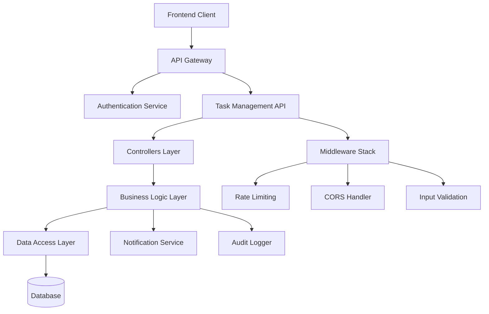
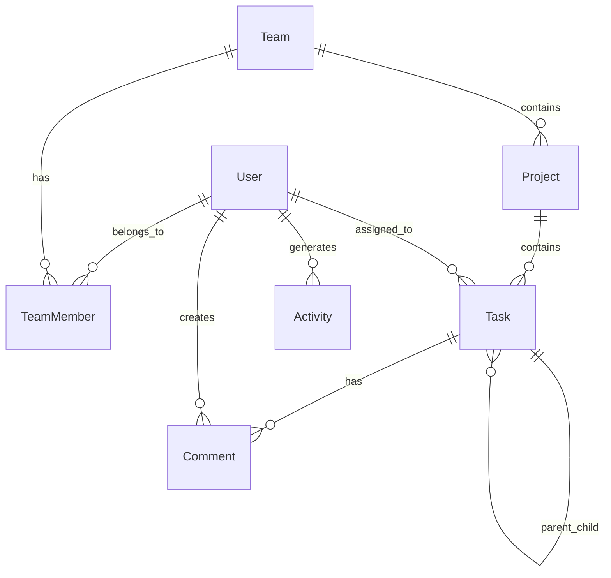

# Design Document

## Overview

The Task Management API is designed as a RESTful service that enables team collaboration through structured project and task management. The system follows a layered architecture with clear separation of concerns, implementing JWT-based authentication, role-based authorization, and comprehensive audit logging. The API adheres to OpenAPI 3.0 standards and supports high-performance operations with cursor-based pagination and efficient data access patterns.

## Architecture

### System Architecture



### Technology Stack

- **Framework**: Spring Boot 3.x with Java 17+
- **Security**: Spring Security with JWT (RS256 signing)
- **Database**: PostgreSQL with Spring Data JPA and HikariCP connection pooling
- **Caching**: Redis with Spring Cache abstraction
- **Documentation**: OpenAPI 3.0 with SpringDoc (Swagger UI)
- **Validation**: Bean Validation (JSR-303) with Hibernate Validator
- **Logging**: SLF4J with Logback and structured JSON logging

## Components and Interfaces

### Authentication & Authorization

#### Spring Security Configuration
- **JWT Implementation**: Spring Security JWT with custom JwtAuthenticationProvider
- **Password Encoding**: BCryptPasswordEncoder with strength 12
- **Method Security**: @PreAuthorize annotations for role-based access
- **CORS**: Spring Security CORS configuration

#### JWT Token Structure
```json
{
  "sub": "user_id",
  "email": "user@example.com", 
  "role": "Manager",
  "teams": ["team_id_1", "team_id_2"],
  "iat": 1640995200,
  "exp": 1641081600
}
```

#### Role-Based Access Control Matrix
| Resource | Admin | Manager | Member |
|----------|-------|---------|--------|
| Users | CRUD | Read | Read (own) |
| Teams | CRUD | CRUD (own) | Read |
| Projects | CRUD | CRUD (team) | Read (assigned) |
| Tasks | CRUD | CRUD (project) | CRUD (assigned) |

### API Endpoints Structure

#### Authentication Endpoints
- `POST /api/v1/auth/register` - User registration
- `POST /api/v1/auth/login` - User authentication
- `POST /api/v1/auth/refresh` - Token refresh
- `POST /api/v1/auth/logout` - Token invalidation

#### User Management Endpoints
- `GET /api/v1/users/profile` - Get current user profile
- `PUT /api/v1/users/profile` - Update user profile
- `GET /api/v1/users/{id}` - Get user by ID (Admin only)

#### Team Management Endpoints
- `POST /api/v1/teams` - Create team
- `GET /api/v1/teams` - List user's teams
- `GET /api/v1/teams/{id}` - Get team details
- `PUT /api/v1/teams/{id}` - Update team
- `DELETE /api/v1/teams/{id}` - Delete team
- `POST /api/v1/teams/{id}/members` - Invite team member
- `DELETE /api/v1/teams/{id}/members/{userId}` - Remove team member

#### Project Management Endpoints
- `POST /api/v1/teams/{teamId}/projects` - Create project
- `GET /api/v1/teams/{teamId}/projects` - List team projects
- `GET /api/v1/projects/{id}` - Get project details
- `PUT /api/v1/projects/{id}` - Update project
- `DELETE /api/v1/projects/{id}` - Delete project

#### Task Management Endpoints
- `POST /api/v1/projects/{projectId}/tasks` - Create task
- `GET /api/v1/projects/{projectId}/tasks` - List project tasks
- `GET /api/v1/tasks/{id}` - Get task details
- `PUT /api/v1/tasks/{id}` - Update task
- `DELETE /api/v1/tasks/{id}` - Delete task
- `POST /api/v1/tasks/{id}/comments` - Add task comment
- `GET /api/v1/tasks/{id}/comments` - Get task comments

#### Activity & Notifications
- `GET /api/v1/activities` - Get user activity feed
- `GET /api/v1/notifications` - Get user notifications
- `PUT /api/v1/notifications/{id}/read` - Mark notification as read

## Data Models

### JPA Entity Structure

#### User Entity
```java
@Entity
@Table(name = "users")
public class User {
    @Id
    @GeneratedValue(strategy = GenerationType.UUID)
    private UUID id;
    
    @Column(unique = true, nullable = false)
    @Email
    private String email;
    
    @Column(nullable = false)
    private String passwordHash;
    
    @Size(min = 1, max = 50)
    private String firstName;
    
    @Size(min = 1, max = 50)
    private String lastName;
    
    @Enumerated(EnumType.STRING)
    private Role role;
    
    @CreationTimestamp
    private LocalDateTime createdAt;
    
    @UpdateTimestamp
    private LocalDateTime updatedAt;
    
    private LocalDateTime lastLogin;
}
```

### User Model (JSON Response)
```json
{
  "id": "uuid",
  "email": "string",
  "firstName": "string",
  "lastName": "string",
  "role": "Admin|Manager|Member",
  "createdAt": "timestamp",
  "updatedAt": "timestamp",
  "lastLogin": "timestamp"
}
```

#### Team Entity
```java
@Entity
@Table(name = "teams")
public class Team {
    @Id
    @GeneratedValue(strategy = GenerationType.UUID)
    private UUID id;
    
    @Column(unique = true, nullable = false)
    @Size(min = 3, max = 50)
    private String name;
    
    @Size(max = 500)
    private String description;
    
    @ManyToOne(fetch = FetchType.LAZY)
    @JoinColumn(name = "owner_id")
    private User owner;
    
    @CreationTimestamp
    private LocalDateTime createdAt;
    
    @UpdateTimestamp
    private LocalDateTime updatedAt;
}
```

#### Project Entity
```java
@Entity
@Table(name = "projects")
public class Project {
    @Id
    @GeneratedValue(strategy = GenerationType.UUID)
    private UUID id;
    
    @ManyToOne(fetch = FetchType.LAZY)
    @JoinColumn(name = "team_id")
    private Team team;
    
    @Size(min = 3, max = 100)
    private String name;
    
    @Size(max = 1000)
    private String description;
    
    @Enumerated(EnumType.STRING)
    private ProjectStatus status;
    
    private LocalDate startDate;
    
    private LocalDate endDate;
    
    @ManyToOne(fetch = FetchType.LAZY)
    @JoinColumn(name = "created_by")
    private User createdBy;
    
    @CreationTimestamp
    private LocalDateTime createdAt;
    
    @UpdateTimestamp
    private LocalDateTime updatedAt;
}
```

#### Task Entity
```java
@Entity
@Table(name = "tasks")
public class Task {
    @Id
    @GeneratedValue(strategy = GenerationType.UUID)
    private UUID id;
    
    @ManyToOne(fetch = FetchType.LAZY)
    @JoinColumn(name = "project_id")
    private Project project;
    
    @ManyToOne(fetch = FetchType.LAZY)
    @JoinColumn(name = "parent_task_id")
    private Task parentTask;
    
    @Size(min = 3, max = 200)
    private String title;
    
    @Size(max = 2000)
    private String description;
    
    @Enumerated(EnumType.STRING)
    private TaskStatus status;
    
    @Enumerated(EnumType.STRING)
    private Priority priority;
    
    @ManyToOne(fetch = FetchType.LAZY)
    @JoinColumn(name = "assignee_id")
    private User assignee;
    
    private LocalDateTime dueDate;
    
    @ManyToOne(fetch = FetchType.LAZY)
    @JoinColumn(name = "created_by")
    private User createdBy;
    
    @CreationTimestamp
    private LocalDateTime createdAt;
    
    @UpdateTimestamp
    private LocalDateTime updatedAt;
}
```

### Database Relationships



## Error Handling

### Error Response Format
```json
{
  "error": {
    "code": "VALIDATION_ERROR",
    "message": "Request validation failed",
    "details": [
      {
        "field": "email",
        "message": "Invalid email format"
      }
    ],
    "request_id": "req_123456789"
  }
}
```

### HTTP Status Code Mapping
- **200 OK**: Successful GET, PUT operations
- **201 Created**: Successful POST operations
- **204 No Content**: Successful DELETE operations
- **400 Bad Request**: Validation errors, malformed requests
- **401 Unauthorized**: Missing or invalid authentication
- **403 Forbidden**: Insufficient permissions
- **404 Not Found**: Resource not found
- **409 Conflict**: Duplicate resources, constraint violations
- **422 Unprocessable Entity**: Business logic errors
- **429 Too Many Requests**: Rate limit exceeded
- **500 Internal Server Error**: Unexpected server errors

### Rate Limiting Strategy
- **Implementation**: Token bucket algorithm with Redis
- **Limits**: 100 requests per minute per user
- **Headers**: Include rate limit information in response headers
- **Backoff**: Exponential backoff recommendations in error responses

## Testing Strategy

### Unit Testing
- **Controllers**: Test with @WebMvcTest for request/response handling
- **Services**: Test with @ExtendWith(MockitoExtension.class) for business logic
- **Repositories**: Test with @DataJpaTest for data access patterns
- **Security**: Test authentication and authorization with @WithMockUser
- **Coverage Target**: 90% code coverage with JaCoCo

### Integration Testing
- **API Endpoints**: Test with @SpringBootTest and TestRestTemplate
- **Database Operations**: Test with @Transactional and test containers
- **Authentication Flow**: Test JWT generation with @AutoConfigureTestDatabase
- **Authorization**: Test role-based access with @WithUserDetails
- **Error Scenarios**: Test exception handling with @ControllerAdvice

### Contract Testing
- **OpenAPI Validation**: Ensure responses match schema definitions
- **Mock Server**: Generate mocks from OpenAPI specification
- **Consumer Testing**: Validate API contracts with frontend teams
- **Backward Compatibility**: Ensure API changes don't break existing clients

### Performance Testing
- **Load Testing**: Test API under expected traffic loads
- **Stress Testing**: Identify breaking points and bottlenecks
- **Response Time**: Validate 95th percentile < 200ms requirement
- **Concurrent Users**: Test multi-user scenarios and race conditions

### Security Testing
- **Authentication**: Test JWT validation and expiration
- **Authorization**: Test role-based access controls
- **Input Validation**: Test injection attacks and malformed data
- **Rate Limiting**: Test rate limit enforcement and bypass attempts

## Security Considerations

### Authentication Security
- **JWT Signing**: Spring Security JWT with RS256 and key rotation
- **Token Expiration**: Short-lived access tokens (15 minutes)
- **Refresh Tokens**: Secure refresh token rotation with Spring Security
- **Password Security**: BCryptPasswordEncoder with strength 12
- **Session Management**: Stateless session with Spring Security

### Data Protection
- **Input Sanitization**: Validate and sanitize all inputs
- **SQL Injection**: Use parameterized queries
- **XSS Prevention**: Proper output encoding
- **CORS Configuration**: Restrict origins in production

### Audit and Monitoring
- **Activity Logging**: Log all CRUD operations with user context
- **Security Events**: Log authentication failures and suspicious activity
- **Performance Monitoring**: Track response times and error rates
- **Alerting**: Set up alerts for security and performance thresholds