# Task Management UI Design Document

## Overview

The Task Management UI is designed as a modern, responsive single-page application (SPA) that provides an intuitive interface for team collaboration and task management. The application follows contemporary design principles with a clean, minimalist aesthetic while maintaining high functionality and accessibility standards. The UI will integrate seamlessly with the Spring Boot API backend through RESTful API calls.

## Architecture

### Frontend Architecture


### Technology Stack

- **Framework**: React 18+ with TypeScript
- **State Management**: Zustand or Redux Toolkit
- **Routing**: React Router v6
- **UI Library**: Tailwind CSS with Headless UI or Shadcn/ui
- **HTTP Client**: Axios with interceptors
- **Form Handling**: React Hook Form with Zod validation
- **Real-time**: WebSocket or Server-Sent Events
- **Build Tool**: Vite
- **Testing**: Vitest + React Testing Library

## Design System

### Color Palette

#### Primary Colors
- **Primary**: `#3B82F6` (Blue-500) - Main brand color for buttons and links
- **Primary Dark**: `#1D4ED8` (Blue-700) - Hover states and emphasis
- **Primary Light**: `#DBEAFE` (Blue-100) - Backgrounds and subtle highlights

#### Semantic Colors
- **Success**: `#10B981` (Emerald-500) - Completed tasks, success messages
- **Warning**: `#F59E0B` (Amber-500) - Pending items, warnings
- **Error**: `#EF4444` (Red-500) - Errors, critical items
- **Info**: `#6366F1` (Indigo-500) - Information, neutral actions

#### Neutral Colors
- **Gray-50**: `#F9FAFB` - Light backgrounds
- **Gray-100**: `#F3F4F6` - Card backgrounds
- **Gray-200**: `#E5E7EB` - Borders, dividers
- **Gray-500**: `#6B7280` - Secondary text
- **Gray-900**: `#111827` - Primary text

### Typography

#### Font Stack
- **Primary**: Inter, system-ui, sans-serif
- **Monospace**: 'Fira Code', Consolas, monospace

#### Type Scale
- **Heading 1**: 2.25rem (36px) - Page titles
- **Heading 2**: 1.875rem (30px) - Section headers
- **Heading 3**: 1.5rem (24px) - Card titles
- **Body Large**: 1.125rem (18px) - Important content
- **Body**: 1rem (16px) - Default text
- **Body Small**: 0.875rem (14px) - Secondary text
- **Caption**: 0.75rem (12px) - Labels, metadata

### Spacing System

Based on 4px grid system:
- **xs**: 4px (0.25rem)
- **sm**: 8px (0.5rem)
- **md**: 16px (1rem)
- **lg**: 24px (1.5rem)
- **xl**: 32px (2rem)
- **2xl**: 48px (3rem)
- **3xl**: 64px (4rem)

## Component Architecture

### Layout Components

#### AppLayout
```tsx
interface AppLayoutProps {
  children: React.ReactNode;
  sidebar?: boolean;
}

// Main application shell with navigation and content area
```

#### Sidebar Navigation
```tsx
interface SidebarProps {
  isCollapsed: boolean;
  onToggle: () => void;
}

// Collapsible sidebar with navigation items and user profile
```

#### TopBar
```tsx
interface TopBarProps {
  title: string;
  actions?: React.ReactNode;
  breadcrumbs?: BreadcrumbItem[];
}

// Top navigation bar with title, breadcrumbs, and action buttons
```

### Core UI Components

#### Button System
```tsx
interface ButtonProps {
  variant: 'primary' | 'secondary' | 'outline' | 'ghost' | 'danger';
  size: 'sm' | 'md' | 'lg';
  loading?: boolean;
  disabled?: boolean;
  icon?: React.ReactNode;
}
```

#### Form Components
```tsx
interface InputProps {
  label: string;
  error?: string;
  required?: boolean;
  type: 'text' | 'email' | 'password' | 'textarea';
}

interface SelectProps {
  label: string;
  options: Option[];
  multiple?: boolean;
  searchable?: boolean;
}
```

#### Card Component
```tsx
interface CardProps {
  title?: string;
  subtitle?: string;
  actions?: React.ReactNode;
  children: React.ReactNode;
  className?: string;
}
```

## Page Layouts and User Flows

### Authentication Flow

#### Login Page
- Clean, centered login form
- Email and password fields with validation
- "Remember me" checkbox
- "Forgot password" link
- Registration link

#### Registration Page
- Multi-step form with progress indicator
- Personal information step
- Account credentials step
- Email verification step

### Dashboard Layout

#### Main Dashboard


#### Dashboard Widgets
- **Task Summary Cards**: Todo, In Progress, Completed counts
- **Recent Activity Feed**: Timeline of recent actions
- **My Tasks**: Quick task list with status indicators
- **Project Progress**: Progress bars for active projects
- **Notifications Panel**: Recent notifications and alerts

### Team Management Interface

#### Teams List View
- Grid layout of team cards
- Team name, member count, and recent activity
- "Create Team" floating action button
- Search and filter options

#### Team Detail View
- Team information header
- Member list with roles and status
- Project list within the team
- Activity timeline
- Settings and management options

### Project Management Interface

#### Projects Overview
- Kanban-style board or list view toggle
- Project cards with status, progress, and team info
- Filtering by status, team, and date range
- Create project modal

#### Project Detail View
- Project header with status and progress
- Task board (Kanban or list view)
- Team members section
- Project timeline and milestones
- Settings and configuration

### Task Management Interface

#### Kanban Board

```mermaid
graph LR
    Todo[📋 To Do] --> Progress[⚡ In Progress]
    Progress --> Review[👀 In Review]
    Review --> Done[✅ Done]
    
    Todo --> TaskCard1[Task Card]
    Progress --> TaskCard2[Task Card]
    Review --> TaskCard3[Task Card]
    Done --> TaskCard4[Task Card]
```


#### Task Card Design
- Task title and description preview
- Priority indicator (color-coded)
- Assignee avatar
- Due date with urgency indicators
- Status badge
- Comment count and attachment indicators
- Drag handle for reordering

#### Task Detail Modal
- Full task information
- Editable fields with inline editing
- Comment thread with rich text editor
- Activity timeline
- Subtask list with progress
- File attachments area

## Responsive Design Strategy

### Breakpoints
- **Mobile**: 320px - 767px
- **Tablet**: 768px - 1023px
- **Desktop**: 1024px - 1439px
- **Large Desktop**: 1440px+

### Mobile Adaptations
- Collapsible navigation drawer
- Stacked card layouts
- Touch-friendly button sizes (44px minimum)
- Simplified Kanban board with horizontal scroll
- Bottom sheet modals for forms

### Tablet Adaptations
- Sidebar can be toggled or persistent
- Grid layouts with 2-3 columns
- Larger touch targets
- Optimized for both portrait and landscape

## State Management

### Store Structure
```typescript
interface AppState {
  auth: AuthState;
  user: UserState;
  teams: TeamsState;
  projects: ProjectsState;
  tasks: TasksState;
  notifications: NotificationsState;
  ui: UIState;
}
```

### State Slices

#### Auth State
```typescript
interface AuthState {
  isAuthenticated: boolean;
  token: string | null;
  user: User | null;
  loading: boolean;
  error: string | null;
}
```

#### Tasks State
```typescript
interface TasksState {
  items: Task[];
  loading: boolean;
  error: string | null;
  filters: TaskFilters;
  selectedTask: Task | null;
}
```

## API Integration

### HTTP Client Configuration
```typescript
// API client with interceptors for auth and error handling
const apiClient = axios.create({
  baseURL: process.env.VITE_API_BASE_URL,
  timeout: 10000,
});

// Request interceptor for auth token
apiClient.interceptors.request.use((config) => {
  const token = getAuthToken();
  if (token) {
    config.headers.Authorization = `Bearer ${token}`;
  }
  return config;
});
```

### API Service Layer
```typescript
interface ApiService {
  auth: AuthService;
  users: UserService;
  teams: TeamService;
  projects: ProjectService;
  tasks: TaskService;
  notifications: NotificationService;
}
```

## Real-time Features

### WebSocket Integration
- Real-time task updates
- Live notifications
- Collaborative editing indicators
- Online user presence
- Activity feed updates

### Optimistic Updates
- Immediate UI updates for better UX
- Rollback on API errors
- Conflict resolution strategies
- Loading states for async operations

## Accessibility Features

### WCAG 2.1 AA Compliance
- Semantic HTML structure
- ARIA labels and roles
- Keyboard navigation support
- Focus management
- Color contrast ratios > 4.5:1
- Screen reader compatibility

### Keyboard Shortcuts
- `Ctrl/Cmd + K`: Global search
- `N`: Create new task
- `Esc`: Close modals
- `Tab/Shift+Tab`: Navigation
- `Enter/Space`: Activate buttons

## Performance Optimization

### Code Splitting
- Route-based code splitting
- Component lazy loading
- Dynamic imports for heavy features

### Caching Strategy
- API response caching
- Image optimization and caching
- Service worker for offline support

### Bundle Optimization
- Tree shaking for unused code
- Minification and compression
- CDN for static assets

## Testing Strategy

### Unit Testing
- Component testing with React Testing Library
- Hook testing with custom test utilities
- Service layer testing with mocked APIs
- Utility function testing

### Integration Testing
- User flow testing
- API integration testing
- Form submission and validation testing
- Navigation and routing testing

### E2E Testing
- Critical user journeys
- Cross-browser compatibility
- Mobile responsiveness testing
- Accessibility testing with axe-core

## Security Considerations

### Authentication Security
- JWT token storage in httpOnly cookies
- Automatic token refresh
- Secure logout with token invalidation
- CSRF protection

### Data Protection
- Input sanitization
- XSS prevention
- Secure API communication (HTTPS)
- Content Security Policy headers

### Privacy Features
- User data encryption
- Secure file uploads
- Privacy-compliant analytics
- GDPR compliance features